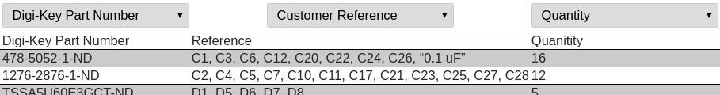

# Ordering the PCB Components

This document describes how to order the electrical components for the Apothecary Microlab PCB.

## Info

Cost is USD $30 - $35 + shipping from Digi-Key and takes one to two days to ship within North America.

Includes parts for one Microlab PCBs. If you'd like to assemble more, multiply the quanities in the spreadsheet.

## Steps

### Download the BOM

Git clone or download this repository onto your machine.

Alternatively, you can just download the [outputs/microlab-BOM.xls](../outputs/microlab-BOM.xls) file directly from GitHub.

### Create a Digi-Key account

Go to [digikey.com](https://www.digikey.com/) and select your country / region on the top right.

Register to create an account.

### Upload the BOM

Once logged in, view your shopping cart on the top right.

Upload the microlab-BOM.xls file to the shopping cart.

Set the first part record to row three:

Scroll to the right and assign the last three columns of the table to "Digi-Key Part Number", "Customer Reference" and "Quanitity":

Click "Add to new cart" and allow it to process your request.

### Order the parts

Review your cart and press the "Checkout" button. Enter your address and payment info.

Place your order, and you are done!
