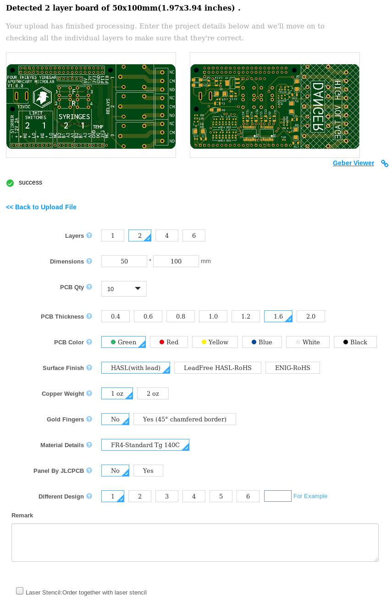

# Ordering the PCB

This document describes how to order the Apothecary Microlab PCB to be manufactured.

## Info

Cost is USD $2 + $20 shipping from JLC PCB and takes six days to manufacture and ship to North America.

Includes 10 Microlab PCBs.

## Steps

### Prepare the Gerbers

Git clone or download this repository onto your machine.

Zip all the files in the [outputs/gerbers](../outputs/gerbers) directory into a single archive. Ensure the files are at the root of the archive and not inside a sub-directory.

### Create a JLC PCB account

Go to [jlcpcb.com](https://jlcpcb.com/) and sign up for an account. We use them because they have a special offer of $2 for 10 PCBs and have been tested.

### Upload Gerber files

On the home page, select "Quote Now" for a 2-layer PCB.

Press "Add your gerber file" and upload the .zip file you created. After a short time, it will show a rendering of the PCB.

_Note:_ The bottom side of the render will be mirrored on the website, but not on the real PCBs.

Leave the PCB options on their defaults:

### Order PCBs

Press "Add to cart" and then "Checkout securely". Enter your address and payment info. Ensure "Pay Directly" is selected.

Place your order, and you are done!
